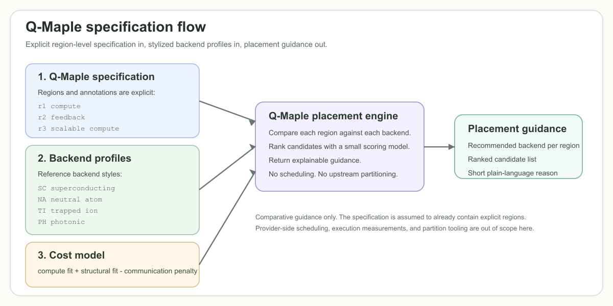

# Q-Maple

Q-Maple is a small research prototype for capability-driven placement guidance over heterogeneous quantum workflows.

The current prototype starts from an explicit Q-Maple workflow specification: a lightweight, placement-oriented intermediate representation in which execution regions and annotations are already provided.



## What It Does

Q-Maple reads:

1. a Q-Maple workflow specification
2. backend capability profiles
3. a simple cost model

It returns profile-based placement guidance for each predefined execution region, including a recommended backend, a ranked candidate list, and a short reason.

## Scope And Boundaries

| Area | Status | Notes |
| --- | --- | --- |
| Explicit region-level specification | In scope | Current input to the prototype |
| Backend reference profiles | In scope | Stylized profiles for comparative guidance |
| Placement guidance | In scope | Advisory output, not binding execution decisions |
| Transparent scoring model | In scope | Small and readable on purpose |
| Raw workflow ingestion | Out of scope | Not implemented here |
| Automatic semantic partitioning | Out of scope | Region derivation is not handled by Q-Maple |
| Upstream partition/decomposition tools | Out of scope | Future upstream source, not part of this repo |
| Provider scheduling or reservations | Out of scope | Q-Maple is not a scheduler |
| Real hardware performance prediction | Out of scope | Output is profile-based, not measured truth |
| User-facing workflow DSL | Out of scope | The JSON examples are serialized specifications, not a DSL |

Input assumptions:

- execution regions are predefined
- annotations are supplied explicitly
- backend profiles are stylized reference profiles
- output is comparative and advisory

In a broader toolchain, specifications may be authored manually or produced by workflow systems, C2/Q outputs, or future partition/decomposition tools. Those upstream sources are not implemented in this repository.

## Quick Start

Q-Maple targets Python 3.10+ and currently uses only the Python standard library.

Run the demo:

```bash
python -m qmaple.demo
```

Run the tests:

```bash
python -m unittest discover -s tests -v
```

The demo reads the committed example inputs and writes [sample_result.json](/Users/mac/Documents/GitHub/Q-Maple/outputs/sample_result.json).

## Repository

- `examples/workflow_example.json`: small Q-Maple specification with predefined regions
- `examples/backend_profiles_example.json`: four reference backend profiles
- `outputs/sample_result.json`: committed demo output
- `qmaple/`: loaders, scoring model, placement engine, and demo entry point
- `docs/`: short project notes and workflow specification description
- `tests/`: lightweight smoke and unit tests

## Open Source Note

This repository is meant to support a positioning paper and early experimentation. It is intentionally small, dependency-light, and easy to inspect.

Contributions are welcome if they keep the scope narrow and improve clarity, examples, or correctness. See [CONTRIBUTING.md](/Users/mac/Documents/GitHub/Q-Maple/CONTRIBUTING.md) for the short contribution guide.

The repository is released under Apache License 2.0.
